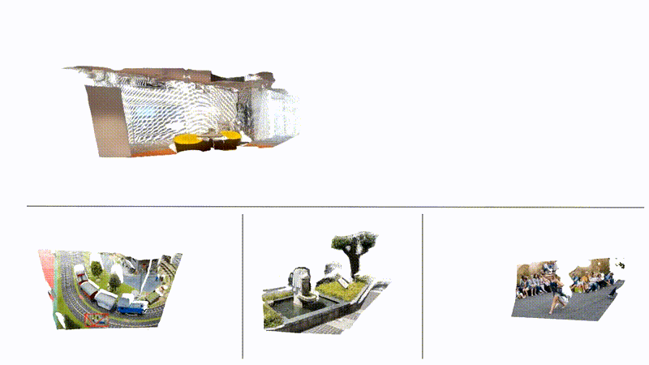
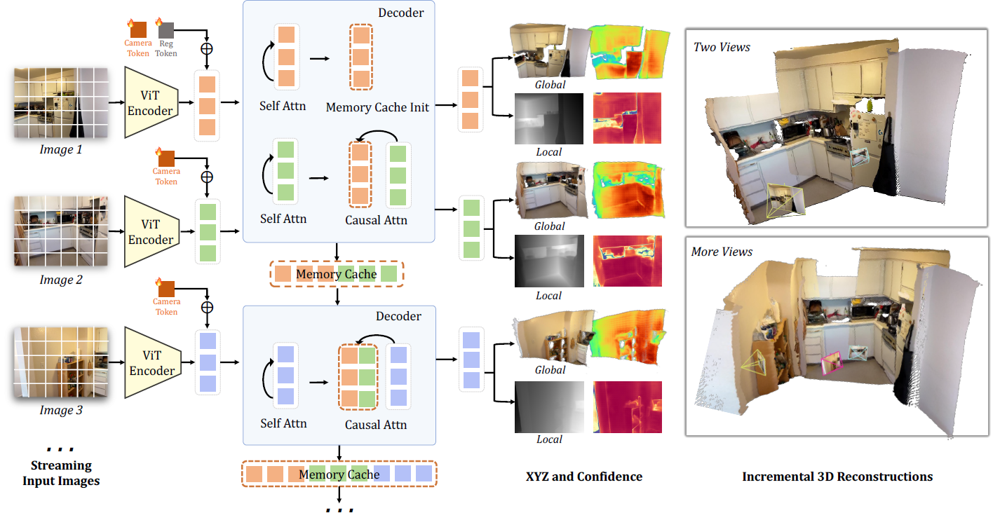

<div align="center">
    <h1>
    STream3R: Scalable Sequential 3D Reconstruction with Causal Transformer
    </h1>
</div>

<div align="center">
    <h4>
        <a href="https://nirvanalan.github.io/projects/stream3r" target='_blank'>
        
        </a>
        <a href="https://arxiv.org/abs/2508.10893" target='_blank'>
        
        </a>
        
    </h4>
    <div >
        <a href='https://nirvanalan.github.io/' target='_blank'>Yushi Lan</a><sup>1*</sup>&emsp;
        <a href='https://scholar.google.com/citations?user=fZxK2B0AAAAJ&hl' target='_blank'>Yihang Luo</a><sup>1*</sup>&emsp;
        <a href='https://hongfz16.github.io' target='_blank'>Fangzhou Hong</a><sup>1</sup>&emsp;
        <a href='https://shangchenzhou.com/' target='_blank'>Shangchen Zhou</a><sup>1</sup>&emsp;
        <a href='https://chenhonghua.github.io/clay.github.io/' target='_blank'>Honghua Chen</a><sup>1</sup>&emsp;
        <br>
        <a href='https://zhaoyanglyu.github.io/' target='_blank'>Zhaoyang Lyu</a><sup>2</sup>&emsp;
        <a href='https://williamyang1991.github.io/' target='_blank'>Shuai Yang</a><sup>3</sup>&emsp;
        <a href='https://daibo.info/' target='_blank'>Bo Dai</a>
        <sup>4</sup>
        <a href='https://www.mmlab-ntu.com/person/ccloy/' target='_blank'>Chen Change Loy</a>
        <sup>1</sup> &emsp;
        <a href='https://xingangpan.github.io/' target='_blank'>Xingang Pan</a>
        <sup>1</sup>
    </div>
    <div>
        S-Lab, Nanyang Technological University<sup>1</sup>;
        <!-- &emsp; -->
        <br>
        Shanghai Artificial Intelligence Laboratory<sup>2</sup>;
        WICT, Peking University<sup>3</sup>;
        The University of Hong Kong <sup>4</sup>
        <!-- <br>
        <sup>*</sup>corresponding author -->
    </div>
</div>

<br>

<div align="center">
    <p>
        <span style="font-variant: small-caps;"><strong>STream3R</strong></span> reformulates dense 3D reconstruction into a sequential registration task with causal attention.
        <br>
        <i>⭐ Now supports <b>FlashAttention</b>, <b>KV Cache</b>, <b>Causal Attention</b>, <b>Sliding Window Attention</b>, and <b>Full Attention</b>!</i>
    </p>
    
    :open_book: See more visual results on our <a href="https://nirvanalan.github.io/projects/stream3r" target="_blank">project page</a>
</div>

<br>

<details>
<summary><b>Abstract</b></summary>
    <br>
    <div align="center">
        
        <p align="justify">
            We present STream3R, a novel approach to 3D reconstruction that reformulates pointmap prediction as a decoder-only Transformer problem. Existing state-of-the-art methods for multi-view reconstruction either depend on expensive global optimization or rely on simplistic memory mechanisms that scale poorly with sequence length. In contrast, STream3R introduces an streaming framework that processes image sequences efficiently using causal attention, inspired by advances in modern language modeling. By learning geometric priors from large-scale 3D datasets, STream3R generalizes well to diverse and challenging scenarios, including dynamic scenes where traditional methods often fail. Extensive experiments show that our method consistently outperforms prior work across both static and dynamic scene benchmarks. Moreover, STream3R is inherently compatible with LLM-style training infrastructure, enabling efficient large-scale pretraining and fine-tuning for various downstream 3D tasks. Our results underscore the potential of causal Transformer models for online 3D perception, paving the way for real-time 3D understanding in streaming environments.
        </p>
    </div>
</details>


## :fire: News

- [Sep 16, 2025] The complete training code is released!
- [Aug 22, 2025] The evaluation code is now available!
- [Aug 15, 2025] Our inference code and weights are released!


## 🔧 Installation

1. Clone Repo
    ```bash
    git clone https://github.com/NIRVANALAN/STream3R
    cd STream3R
    ```

2. Create Conda Environment 
    ```bash
    conda create -n stream3r python=3.11 cmake=3.14.0 -y
    conda activate stream3r
    ```
3. Install Python Dependencies

    **Important:** Install [Torch](https://pytorch.org/get-started/locally/) based on your CUDA version. For example, for *Torch 2.8.0 + CUDA 12.6*:

    ```
    # Install Torch
    pip3 install torch torchvision --index-url https://download.pytorch.org/whl/cu126

    # Install other dependencies
    pip install -r requirements.txt

    # Install STream3R as a package
    pip install -e .
    ```

## :computer: Inference

You can now try STream3R with the following code. The checkpoint will be downloaded automatically from [Hugging Face](https://huggingface.co/yslan/STream3R). 

You can set the inference mode to `causal` for causal attention, `window` for sliding window attention (with a default window size of 5), or `full` for bidirectional attention.

```python
import os
import torch
from stream3r.models.stream3r import STream3R
from stream3r.models.components.utils.load_fn import load_and_preprocess_images

device = "cuda" if torch.cuda.is_available() else "cpu"

model = STream3R.from_pretrained("yslan/STream3R").to(device)

example_dir = "examples/static_room"
image_names = [os.path.join(example_dir, file) for file in sorted(os.listdir(example_dir))]
images = load_and_preprocess_images(image_names).to(device)

with torch.no_grad():
    # Use one mode "causal", "window", or "full" in a single forward pass
    predictions = model(images, mode="causal")
``` 

We also support a KV cache version to enable streaming input using `StreamSession`. The `StreamSession` takes sequential input and processes them one by one, making it suitable for real-time or low-latency applications. This streaming 3D reconstruction pipeline can be applied in various scenarios such as real-time robotics, autonomous navigation, online 3D understanding and SLAM. An example usage is shown below:

```python
import os
import torch
from stream3r.models.stream3r import STream3R
from stream3r.stream_session import StreamSession
from stream3r.models.components.utils.load_fn import load_and_preprocess_images

device = "cuda" if torch.cuda.is_available() else "cpu"

model = STream3R.from_pretrained("yslan/STream3R").to(device)

example_dir = "examples/static_room"
image_names = [os.path.join(example_dir, file) for file in sorted(os.listdir(example_dir))]
images = load_and_preprocess_images(image_names).to(device)
# StreamSession supports KV cache management for both "causal" and "window" modes.
session = StreamSession(model, mode="causal")

with torch.no_grad():
    # Process images one by one to simulate streaming inference
    for i in range(images.shape[0]):
        image = images[i : i + 1]
        predictions = session.forward_stream(image)
    session.clear()
``` 

## :zap: Demo
You can run the demo built on [VGG-T's code](https://github.com/facebookresearch/vggt) using the script [`app.py`](app.py) with the following command:

```sh
python app.py
```

## 📁 Code Structure

The repository is structured as follows:

```
STream3R/
├── stream3r/                    
│   ├── models/                  
│   │   ├── stream3r.py            
│   │   ├── multiview_dust3r_module.py  
│   │   └── components/               
│   ├── dust3r/                 
│   ├── croco/                  
│   ├── utils/                  
│   └── stream_session.py          
├── configs/                     
├── examples/                    
├── assets/                      
├── app.py                          
├── requirements.txt                 
├── setup.py                        
└── README.md                       
```

## :100: Quantitive Results

*3D Reconstruction Comparison on NRGBD.*

| Method              | Type     | Acc Mean ↓ | Acc Med. ↓ | Comp Mean ↓ | Comp Med. ↓ | NC Mean ↑ | NC Med. ↑ |
|---------------------|----------|------------|------------|-------------|-------------|-----------|-----------|
| VGG-T      | FA        | 0.073  | 0.018  | 0.077   | 0.021   | 0.910 | 0.990 |
| DUSt3R | Optim    | 0.144      | 0.019    | 0.154       | 0.018     | 0.870   | 0.982   |
| MASt3R | Optim    | 0.085    | 0.033      | 0.063     | 0.028       | 0.794     | 0.928     |
| MonST3R | Optim   | 0.272      | 0.114      | 0.287       | 0.110       | 0.758     | 0.843     |
| Spann3R   | Stream   | 0.416      | 0.323      | 0.417       | 0.285       | 0.684     | 0.789     |
| CUT3R       | Stream   | 0.099      | 0.031    | 0.076       | 0.026     | 0.837     | 0.971     |
| StreamVGGT     | Stream   | 0.084    | 0.044      | 0.074     | 0.041       | 0.861   | 0.986   |
| Ours   | Stream   | **0.057**  | **0.014**  | **0.028**   | **0.013**   | **0.910** | **0.993** |

Read our [full paper](https://arxiv.org/abs/2508.10893) for more insights.

## ⏳ GPU Memory Usage and Runtime

We report the peak GPU memory usage (VRAM) and runtime of our full model for processing each streaming input using the `StreamSession` implementation. All experiments were conducted at a common resolution of 518 × 384 on a single H200 GPU. The benchmark includes both *Causal* for causal attention and *Window* for sliding window attention with a window size of 5.


*Run Time (s).*
| Num of Frames      | 1      | 20     | 40     | 80     | 100    | 120    | 140    | 180    | 200    |
|-----------|--------|--------|--------|--------|--------|--------|--------|--------|--------|
| Causal    | 0.1164 | 0.2034 | 0.3060 | 0.4986 | 0.5945 | 0.6947 | 0.7916 | 0.9911 | 1.1703 |
| Window    | 0.1167 | 0.1528 | 0.1523 | 0.1517 | 0.1515 | 0.1512 | 0.1482 | 0.1443 | 0.1463 |


*VRAM (GB).*
| Num of Frames      | 1      | 20     | 40     | 80     | 100    | 120    | 140    | 180    | 200    |
|-----------|--------|--------|--------|--------|--------|--------|--------|--------|--------|
| Causal    | 5.49   | 9.02   | 12.92  | 21.00  | 25.03  | 29.10  | 33.21  | 41.31  | 45.41  |
| Window    | 5.49   | 6.53   | 6.53   | 6.53   | 6.53   | 6.53   | 6.53   | 6.53   | 6.53   |


## :hotsprings: Training

1. Prepare Dataset

    We follow [CUT3R](https://github.com/CUT3R/CUT3R/blob/main/docs/preprocess.md) to preprocess the dataset for training.

2. Set Up Config

    Update training config file ```configs/experiment/stream3r/stream3r.yaml``` as needed. For example:
    - Set `pretrained` to the path of the [VGG-T checkpoint](https://huggingface.co/facebook/VGGT-1B/resolve/main/model.pt).
    - Set `data_root` to the directory where you saved the processed dataset. 

3. Launch training with:
    ```bash
    python fast3r/train.py experiment=stream3r/stream3r
    ```

4. After training, you can convert the checkpoint into a `state_dict` file, for example:
    ```python
    from lightning.pytorch.utilities.deepspeed import convert_zero_checkpoint_to_fp32_state_dict

    convert_zero_checkpoint_to_fp32_state_dict(
        checkpoint_dir="logs/stream3r/runs/stream3r_99999/checkpoints/000-00002000.ckpt",
        output_file="logs/stream3r/runs/stream3r_99999/checkpoints/last_aggregated.ckpt",
        tag=None
    )
    ```

## 📈 Evaluation

The evaluation follows [MonST3R](https://github.com/Junyi42/monst3r) and [Spann3R](https://github.com/HengyiWang/spann3r), [CUT3R](https://github.com/CUT3R/CUT3R).

1. Prepare Evaluation Dataset

    We follow the dataset preparation guides from [MonST3R](https://github.com/Junyi42/monst3r/blob/main/data/evaluation_script.md) and [Spann3R](https://github.com/HengyiWang/spann3r/blob/main/docs/data_preprocess.md) to prepare the datasets. For convenience, we provide the processed datasets on [Hugging Face](https://huggingface.co/datasets/yslan/pointmap_regression_evalsets), which can be downloaded directly.

    The datasets should be organized as follows under the root directiory of the project:
    ```
    data/
    ├── 7scenes
    ├── bonn
    ├── kitti
    ├── neural_rgbd
    ├── nyu-v2
    ├── scannetv2
    ├── sintel
    └── tum
    ```

2. Run Evaluation

    Use the provided scripts to evaluate different tasks.

    *For Video Depth and Camera Pose Estimation, some datasets contain more than 100 images. To reduce memory usage, we use `StreamSession` to process frames sequentially while managing the KV cache.*

    ### Monodepth

    ```bash
    bash eval/monodepth/run.sh
    ```
    Results will be saved in `eval_results/monodepth/${model_name}/${data}/metric.json`.

    ### Video Depth

    ```bash
    bash eval/video_depth/run.sh
    ```
    Results will be saved in `eval_results/video_depth/${model_name}/${data}/result_scale.json`.

    ### Camera Pose Estimation

    ```bash
    bash eval/relpose/run.sh
    ```
    Results will be saved in `eval_results/relpose/${model_name}/${data}/_error_log.txt`.

    ### Multi-view Reconstruction

    ```bash
    bash eval/mv_recon/run.sh
    ```
    Results will be saved in `eval_results/mv_recon/${model_name}/${data}/logs_all.txt`.


## :calendar: TODO

- [x] Release evaluation code.
- [x] Release training code.
- [ ] Release the metric-scale version.


## :page_with_curl: License

This project is licensed under <a rel="license" href="./LICENSE">NTU S-Lab License 1.0</a>. Redistribution and use should follow this license.

## :pencil: Citation

If you find our code or paper helps, please consider citing:

```bibtex
@article{stream3r2025,
  title={STream3R: Scalable Sequential 3D Reconstruction with Causal Transformer},
  author={Lan, Yushi and Luo, Yihang and Hong, Fangzhou and Zhou, Shangchen and Chen, Honghua and Lyu, Zhaoyang and Yang, Shuai and Dai, Bo and Loy, Chen Change and Pan, Xingang},
  booktitle={arXiv preprint arXiv:2508.10893},
  year={2025}
}
```
## :pencil: Acknowledgments
We recognize several concurrent works on streaming methods. We encourage you to check them out:
  
[StreamVGGT](https://github.com/wzzheng/StreamVGGT) &nbsp;|&nbsp; [CUT3R](https://github.com/CUT3R/CUT3R) &nbsp;|&nbsp; [SLAM3R](https://github.com/PKU-VCL-3DV/SLAM3R) &nbsp;|&nbsp; [Spann3R](https://github.com/HengyiWang/spann3r)  

STream3R is built on the shoulders of several outstanding open-source projects. Many thanks to the following exceptional projects:

[VGG-T](https://github.com/facebookresearch/vggt) &nbsp;|&nbsp; [Fast3R](https://github.com/facebookresearch/fast3r) &nbsp;|&nbsp; [DUSt3R](https://github.com/naver/dust3r) &nbsp;|&nbsp; [MonST3R](https://github.com/Junyi42/monst3r) &nbsp;|&nbsp; [Viser](https://github.com/nerfstudio-project/viser)

## :mailbox: Contact
If you have any question, please feel free to contact us via `lanyushi15@gmail.com` or Github issues.